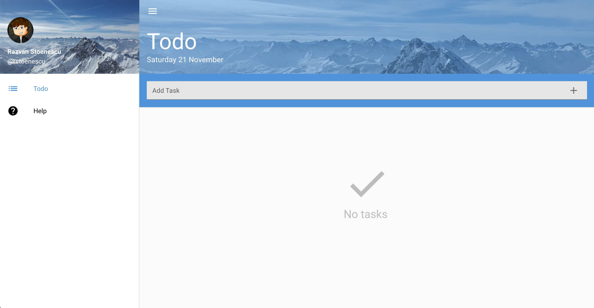
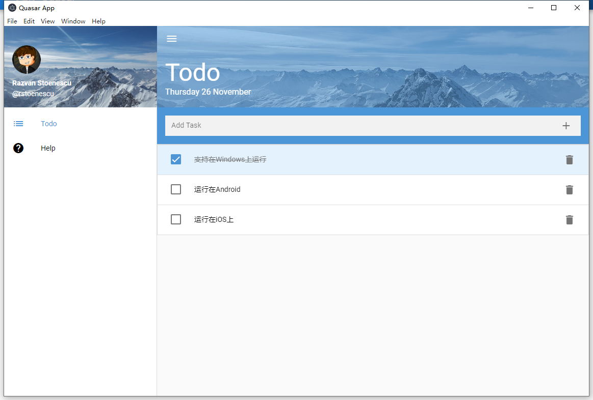

# [Quasar](http://quasar.dev/) Todo App

Quasar Todo

## 安装依赖·
```bash
npm install
```

### 开发模式运行 (hot-code reloading, error reporting, etc.)
```bash
quasar dev
```

### 代码格式校验
```bash
npm run lint
```

### 构建生产包
```bash
quasar build
```

### 自定义配置
详情见 [Configuring quasar.conf.js](https://quasar.dev/quasar-cli/quasar-conf-js).

### 平台支持

同时支持 <code>Android</code> <code>iOS</code> <code>Windows</code> <code>MacOS</code> <code>Web</code> <code>H5</code> etc...

### 预览




